# AI 기반 UI/UX 디자인 시안 - 작업 로그

━━━━━━━━━━━━━━━━━━━━━━━━━━━━━━
## 1. 프로젝트 개요
━━━━━━━━━━━━━━━━━━━━━━━━━━━━━━

| 항목 | 내용 |
|------|------|
| 서비스명 | 카페 주문 APP (Term Cafe Order) |
| 서비스 설명 | 카페 브랜드 Term Cafe 주문 및 결제 APP |
| 타겟 사용자 | 해당 카페를 사용하는 고객 |
| 화면 형식 | 모바일 (9:16) |
| 사용 AI 도구 | 이미지 생성: 제미나이 나노바나나 / 프롬프트 작성 보조: ChatGPT / 프로토타입 생성: Figma Make |
| 팀원 및 역할 | 양원석 - 팀장 / 박세훈, 임유경 - UI 이미지 생성 / 이동인 - Figma 프로젝트 제작 / 박연수 - 작업 로그 문서 작성 |
| 작업 기간 | 2026.07.25 |

━━━━━━━━━━━━━━━━━━━━━━━━━━━━━━
## 2. 화면 구성 계획
━━━━━━━━━━━━━━━━━━━━━━━━━━━━━━

| 화면 번호 | 화면 이름 | 화면 역할 설명 |
|-----------|-----------|----------------|
| Screen 1 | 메인 페이지 | 서비스 진입점으로, 추천 음료·이벤트 배너·빠른 주문 버튼 등 핵심 기능을 한눈에 노출하는 홈 화면 |
| Screen 2 | 마이 페이지 | 사용자 계정 정보, 주문 내역, 적립 포인트 등 개인화된 데이터를 확인하고 관리하는 화면 |
| Screen 3 | 음료 커스텀 페이지 | 선택한 음료의 사이즈·온도·시럽·토핑 등 옵션을 사용자가 직접 조합하여 나만의 음료를 구성하는 화면 |
| Screen 4 | 결제 페이지 | 커스텀된 주문 내역을 최종 확인하고, 결제 수단을 선택하여 주문을 완료하는 화면 |
| Screen 5 | 결제 완료 페이지 | 결제 성공 여부를 안내하고, 주문 번호·예상 대기 시간 등 주문 확인 정보를 제공하는 화면 |

━━━━━━━━━━━━━━━━━━━━━━━━━━━━━━
## 3. 프롬프트 작업 로그
━━━━━━━━━━━━━━━━━━━━━━━━━━━━━━
---

### 🖥️ Screen 1 : 메인 페이지

#### 3-1. 초안 프롬프트

**초안 이미지 프롬프트**

Term Cafe 홈 화면 이미지 생성 프롬프트

모바일 앱 UI 목업, "Term Cafe" 카페 음료 주문 앱의 홈 화면.

[전체 무드]
공차(Gong Cha) 스타일의 밀크티 카페를 모티브로 한 따뜻하면서도 차분한 감성 디자인.
미니멀하고 깔끔한 UI, 여백을 넉넉히 살린 레이아웃.
컬러는 화이트 베이스에 브라운·베이지·크림 톤 포인트, 과하지 않은 톤다운 컬러감.

[상단 영역]
좌측 상단에 "Term Cafe" 워드마크 로고 (심플한 세리프 또는 라운드 산세리프 폰트, 브라운 컬러).
우측에 알림 아이콘 또는 검색 아이콘, 미니멀한 라인 아이콘 스타일.

[중앙 영역 - 메인 콘텐츠]
음료 카테고리를 가로 스크롤 탭으로 구성 (예: 밀크티 / 스무디 / 에이드 / 커피 / 티).
선택된 탭은 브라운 배경 + 화이트 텍스트로 강조, 나머지는 연한 베이지 아웃라인.
그 아래로 음료 메뉴를 2열 그리드의 둥근 카드(rounded corner card)로 배치.
각 카드는 부드러운 그림자, 화이트 배경, 상단에 음료 사진(원형 또는 둥근 사각형 프레임),
하단에 음료명과 가격 텍스트(브라운 계열 폰트 컬러).
카드 우측 하단에 작은 원형 + 버튼(브라운 컬러)으로 담기 기능 암시.

[하단 네비게이션 바]
화면 최하단에 고정된 3단 탭바, 아이콘 + 짧은 라벨 구성:
1. 홈 (왼쪽, 현재 활성 화면 — 브라운 컬러로 강조, 집 모양 아이콘)
2. 마이페이지 (중앙, 비활성 상태 — 연한 회색/베이지 톤, 사람 모양 아이콘)
3. 장바구니 (오른쪽, 비활성 상태 — 연한 회색/베이지 톤, 장바구니 아이콘 — 탭 시 결제 화면으로 바로 연결되는 구조)

[스타일 디테일]
전체적으로 라운드 처리된 요소(카드, 버튼, 아이콘 배경),
과한 그래픽 요소 없이 여백과 타이포그래피 위주의 미니멀 UI,
따뜻한 조명의 음료 사진 톤(우유빛, 카라멜톤),
UI 목업은 실제 스마트폰 프레임 안에 담긴 형태로 표현.

**초안 결과 이미지**
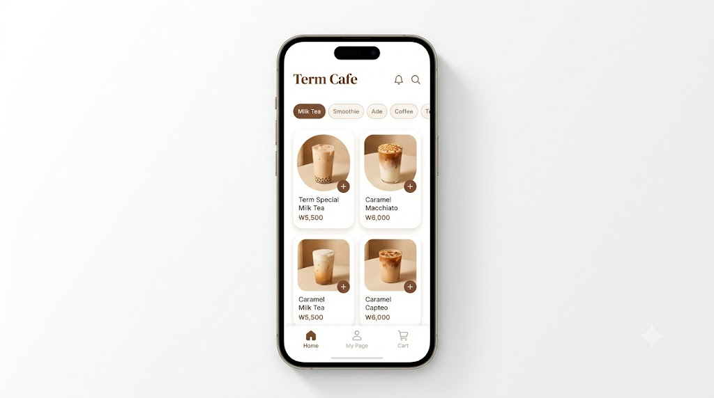

**초안 문제점 분석**
- 텍스트 깨짐 발생 위치: 가격 표기에서 원화 기호(₩)가 빠지고 "W5,500"처럼 알파벳 W로 깨져 표시됨
- 부자연스러운 요소: 스마트폰 프레임 안에 UI가 들어가면서 화면이 좁아져 카테고리 탭이 "T…"로 잘려 보임(Tea 탭 미표시)
- 레이아웃 문제: 메뉴가 4개(2×2)만 노출되어 카페 메뉴 다양성이 부족하고, 프레임 여백 때문에 실제 화면 비율 파악이 어려움
- 색상/스타일 불일치: 전체 톤은 유지됐으나 카드 그림자가 약해 입체감이 다소 부족함
- 기타: 상단에 알림·검색 아이콘이 있어 실제 브랜드 로고 노출이 안 됨

---

#### 3-2. 수정 프롬프트

**수정 이미지 프롬프트**
모바일 앱 UI 목업, "Term Cafe" 카페 음료 주문 앱의 홈 화면.
※ 스마트폰 기기 프레임(테두리, 노치, 버튼 등) 없이, 세로로 긴 화면 비율(9:19.5 비율, 세로형 모바일 스크린)로만 구성된 순수 UI 스크린샷 형태.

[전체 무드]
공차(Gong Cha) 스타일의 밀크티 카페를 모티브로 한 따뜻하면서도 차분한 감성 디자인.
미니멀하고 깔끔한 UI, 여백을 넉넉히 살린 레이아웃.
컬러는 화이트 베이스에 브라운·베이지·크림 톤 포인트, 과하지 않은 톤다운 컬러감.

[상단 영역]
좌측 상단에 "Term Cafe" 워드마크 로고 (심플한 세리프 또는 라운드 산세리프 폰트, 브라운 컬러).
우측에 알림 아이콘 또는 검색 아이콘, 미니멀한 라인 아이콘 스타일.

[중앙 영역 - 메인 콘텐츠]
음료 카테고리를 가로 스크롤 탭으로 구성 (예: 밀크티 / 스무디 / 에이드 / 커피 / 티).
선택된 탭은 브라운 배경 + 화이트 텍스트로 강조, 나머지는 연한 베이지 아웃라인.
그 아래로 음료 메뉴를 2열 그리드의 둥근 카드(rounded corner card)로 배치.
각 카드는 부드러운 그림자, 화이트 배경, 상단에 음료 사진(원형 또는 둥근 사각형 프레임),
하단에 음료명과 가격 텍스트(브라운 계열 폰트 컬러, 원화 표기 예: ₩4,500).
카드 우측 하단에 작은 원형 + 버튼(브라운 컬러)으로 담기 기능 암시.

[하단 네비게이션 바]
화면 최하단에 고정된 3단 탭바, 아이콘 + 짧은 라벨 구성:
1. 홈 (왼쪽, 현재 활성 화면 — 브라운 컬러로 강조, 집 모양 아이콘)
2. 마이페이지 (중앙, 비활성 상태 — 연한 회색/베이지 톤, 사람 모양 아이콘)
3. 장바구니 (오른쪽, 비활성 상태 — 연한 회색/베이지 톤, 장바구니 아이콘 — 탭 시 결제 화면으로 바로 연결되는 구조)

[스타일 디테일]
전체적으로 라운드 처리된 요소(카드, 버튼, 아이콘 배경),
과한 그래픽 요소 없이 여백과 타이포그래피 위주의 미니멀 UI,
따뜻한 조명의 음료 사진 톤(우유빛, 카라멜톤),
모든 가격은 한국 원화(₩) 단위로 표기.

**수정 이유**
초안은 스마트폰 프레임으로 인해 실제 서비스 화면 크기를 가늠하기 어렵고, 가격 표기 기호가 깨져 있었으며 메뉴 수가 적어 카페 앱으로서 정보량이 부족했음. 이를 해결하기 위해 프레임을 제거하고 9:19.5 세로 비율의 순수 UI 스크린샷 형태로 전환, 원화 기호(₩)를 정확히 표기하도록 프롬프트를 수정하고 메뉴를 6종(3×2 그리드)으로 확대함. 이후 최종 단계에서는 상단 영역의 브랜드 아이덴티티를 강화하기 위해 알림·검색 아이콘을 삭제하고 실제 브랜드 로고(컵 일러스트 + 워드마크 + 태그라인)로 교체함.

**수정 결과 이미지**
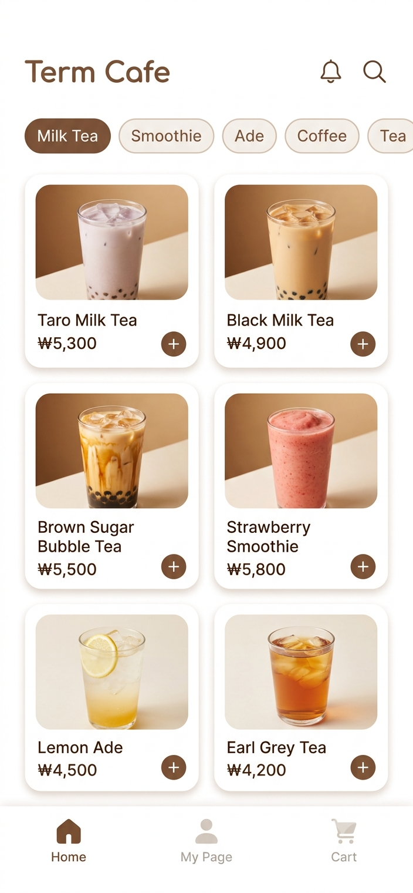

**수정 후 달라진 점**
- 변경 전: 스마트폰 프레임 포함 / 가격 "W5,500" 형태의 기호 깨짐 / 메뉴 4개(2×2) / 상단 알림·검색 아이콘 배치
- 변경 후: 프레임 없는 순수 세로형 UI 스크린샷 / "₩5,500" 형태로 원화 기호 정상 표기 / 메뉴 6개(3×2)로 확대 / 상단 아이콘 삭제 후 브랜드 로고(컵 일러스트+워드마크+태그라인)를 중앙에 배치

---

#### 3-3. 최종 프롬프트

**최종 선택 이유**
수정본을 최종안으로 선택함. 개선된 정확한 원화 표기와 풍부한 메뉴 구성(6종)을 그대로 유지하면서, 실제 브랜드 로고를 상단 중앙에 적용해 아이덴티티 일관성을 확보했고 불필요한 아이콘을 제거해 상단 여백이 한층 정돈되었기 때문임.

**최종 결과 이미지**
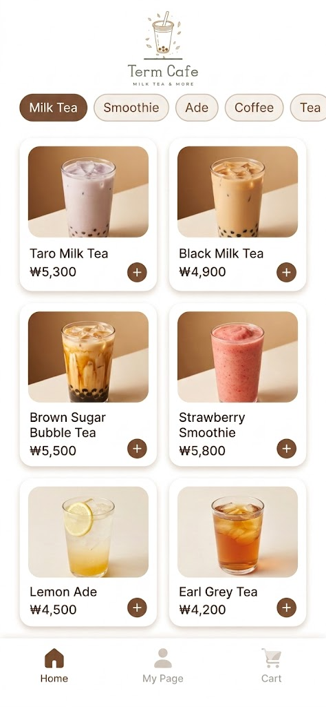

---

### 🖥️ Screen 2 : 마이 페이지

#### 3-1. 초안 프롬프트

**초안 이미지 프롬프트**
모바일 앱 UI 목업, "Term Cafe" 카페 음료 주문 앱의 홈 화면.
※ 스마트폰 기기 프레임(테두리, 노치, 버튼 등) 없이, 세로로 긴 화면 비율(9:19.5 비율, 세로형 모바일 스크린)로만 구성된 순수 UI 스크린샷 형태.

모바일 앱 UI 디자인, 개인 카페 앱의 "마이페이지" 화면.
스타일: 따뜻한 브라운과 크림 베이지 톤, 둥근 모서리 카드형 레이아웃, 미니멀하고 깔끔한 디자인.

화면 구성:
상단: 원형 프로필 사진(기본 이미지)과 그 옆에 닉네임 텍스트 (예: "민지")
그 아래: 가로로 넓은 카드 두 개를 나란히 배치
   - 왼쪽 카드: 포인트 아이콘 + 보유 포인트 숫자 (예: "3,200P")
   - 오른쪽 카드: 쿠폰 아이콘 + 보유 쿠폰 개수 (예: "쿠폰 2장")
   두 카드 모두 크림색 배경에 브라운 텍스트, 부드러운 그림자 효과
그 아래: "주문내역" 섹션 제목
반드시 가장 최근 주문에 레몬에이드 1잔(4,500원)은 들어가도록 해. (음료 이름은 영어)
레몬에이드 사진은 이 대화에서 나온 걸 토대로 제작해.
하단: 세로로 스크롤되는 주문 내역 리스트 카드 3~4개
   - 각 카드에는 작은 음료 썸네일 사진, 음료 이름, 주문 날짜, 가격이 표시됨
   - 카드 스타일은 메인화면의 메뉴 카드와 동일한 톤 (둥근 모서리, 밝은 크림 배경)
최하단: 홈/마이페이지/카트 아이콘이 있는 하단 네비게이션 바 (마이페이지 탭이 활성화 상태, 브라운 색상 강조)

전체적으로 심플한 라인 아이콘, 부드러운 그림자, 여백을 넉넉히 사용한 프로토타입용 UI 목업. 폰트는 둥글고 친근한 산세리프체.
9:19.5 세로 비율, 모바일 앱 화면 목업.

**초안 결과 이미지**
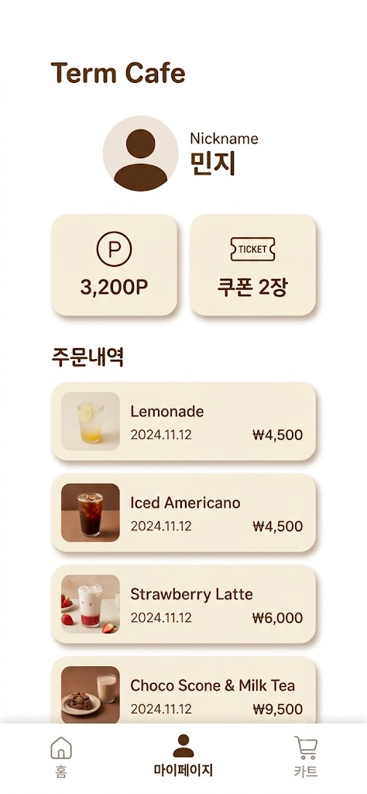

**초안 문제점 분석**
- 텍스트 깨짐 발생 위치: 텍스트 자체가 깨지거나 오타가 난 부분은 없음. 다만 "Term Cafe"가 로고 이미지가 아닌 일반 텍스트 타이틀로만 표시되어 있어 브랜드 요소가 약함.
- 부자연스러운 요소: 주문내역 4개(레모네이드·아이스아메리카노·딸기라떼·초코스콘&밀크티)가 전부 "2024.11.12"로 날짜가 동일함. 실제 주문 이력이라기보다 더미 데이터처럼 보이고, 최신 주문일수록 위에 오는 자연스러운 흐름이 없음.
- 레이아웃 문제: 카드가 4개까지 들어가면서 하단 카드(초코스콘&밀크티)가 화면 하단부에서 다소 답답하게 잘리는 느낌. 요청 범위에도 없던 항목이라 불필요하게 스크롤 영역만 늘림.
- 색상/스타일 불일치: 브라운·크림 톤은 전체적으로 일관되게 유지되어 이 부분은 문제 없음.
- 기타: "개인 카페 앱"이라는 설정에 비해 브랜딩이 약하고, 날짜가 전부 과거(2024년)로 고정되어 있어 현재 시점(2026년 기준) 서비스 화면처럼 보이지 않음.

#### 3-2. 수정 프롬프트

**수정 이미지 프롬프트**
제일 하단에 있는 초코 스콘과 밀크티 부분은 삭제해.
날짜를 상단으로 갈수록 최근으로 하도록 하고 날짜는 일주일 단위로 했을 때 그 안에서 랜덤으로 설정해. 레모네이드 날짜는 26년 7월 25일로 설정해서 다시 제작해.
다른 부분은 절대 수정하지 마

**수정 이유**
위 문제들을 해결하기 위해 ①불필요한 항목(초코스콘&밀크티) 삭제, ②날짜를 위에서 아래로 갈수록 과거가 되도록 최신순 정렬 + 일주일 내 랜덤값 지정, ③기준 주문(레모네이드)을 2026.07.25로 고정 지시함. 나머지 레이아웃·색상은 이미 만족스러웠기 때문에 "다른 부분은 절대 수정하지 마"로 변경 범위를 명확히 제한함.

**수정 결과 이미지**
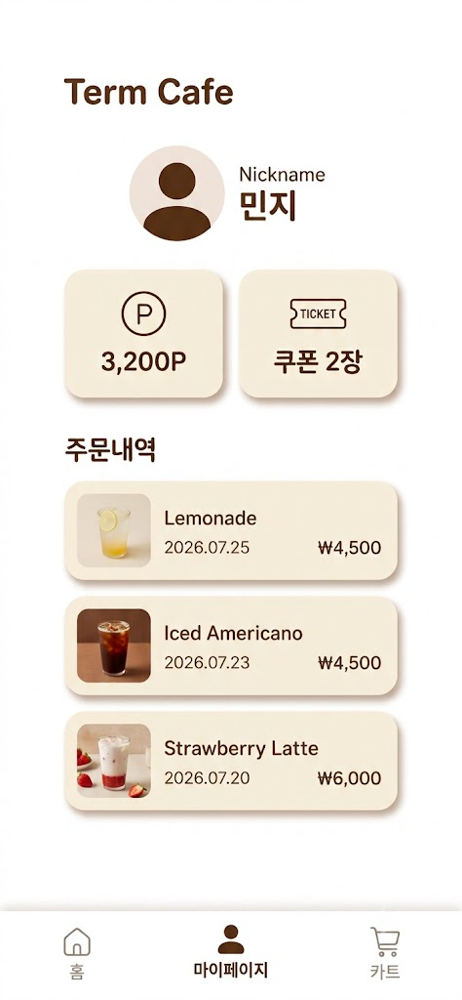

**수정 후 달라진 점**
- 변경 전: 주문내역 4개, 날짜 전부 2024.11.12 동일, 로고 없이 텍스트 타이틀만
- 변경 후: 주문내역 3개로 정리(레모네이드 2026.07.25 / 아이스아메리카노 2026.07.23 / 딸기라떼 2026.07.20), 최신순 정렬 적용. 컵 일러스트 로고 + "MILK TEA & MORE" 서브 카피가 추가된 헤더를 화면 상단 중앙에 배치, 나머지 주문내역·카드·색상·레이아웃은 유지

#### 3-3. 최종 프롬프트

**최종 선택 이유**
로고 이미지가 추가되면서 "개인 카페 앱"이라는 설정에 맞는 브랜드 아이덴티티가 확보됨(텍스트 타이틀 대비 완성도 상승). 요청한 대로 주문내역이 정확히 3개로 정리되고 최신순(2026.07.25 → 07.23 → 07.20)으로 자연스럽게 배치되어 실제 앱 화면처럼 보임. 로고 변경 외 나머지 요소(카드 스타일, 색상 톤, 여백, 하단 네비게이션)를 일절 건드리지 않아 이전 단계에서 이미 검증된 레이아웃 완성도를 그대로 유지함.

**최종 결과 이미지**
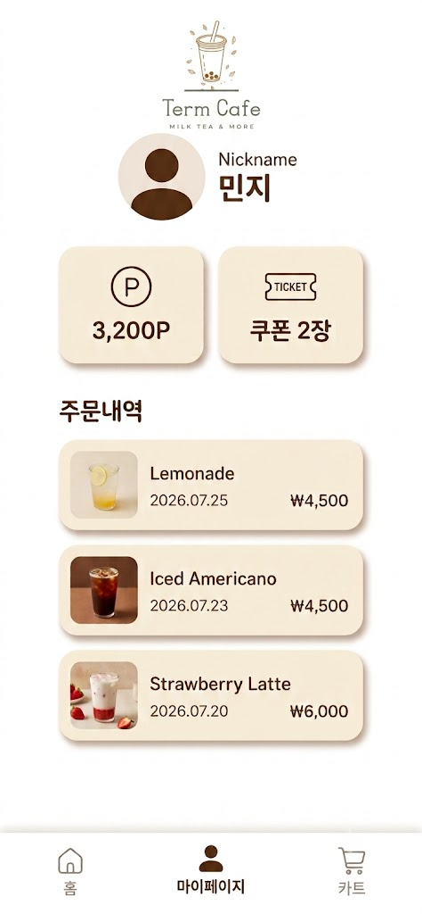

---

### 🖥️ Screen 3 : 음료 커스텀 페이지

#### 3-1. 초안 프롬프트

**초안 이미지 프롬프트**
Term Cafe 음료 커스터마이징 화면 이미지 생성 프롬프트(수정 전)
모바일 앱 UI 목업, "Term Cafe" 카페 음료 주문 앱의 음료 커스터마이징 화면.
따뜻하면서도 차분한 감성 디자인.
미니멀하고 깔끔한 UI, 여백을 넉넉히 살린 레이아웃.
컬러는 화이트 베이스에 브라운·베이지·크림 톤 포인트, 과하지 않은 톤다운 컬러감.
홈 화면과 동일한 디자인 시스템과 컬러 팔레트를 유지한다.

[상단 영역]
좌측 상단에 뒤로가기(←) 아이콘.
가운데에 Customize Drink 제목.
우측에는 하트(즐겨찾기) 아이콘.
심플한 라인 아이콘 스타일.

[중앙 영역 - 메인 콘텐츠]
홈 화면에서 선택한 Lemon Ade 메뉴를 기준으로 커스터마이징 화면을 구성한다.
상단에는 음료 이미지를 크게 배치한다.
음료 아래에는 Lemon Ade / ₩4,500 을 브라운 계열 폰트로 표시한다.

[커스터마이징 옵션]
각 옵션은 둥근 카드(rounded corner card) 형태로 구성한다.
음료 사이즈(Size): Small / Medium(선택) / Large
선택된 버튼은 브라운 배경 + 화이트 텍스트, 나머지는 화이트 배경 + 연한 베이지 테두리.
당도(Sweetness): 0% / 25% / 50%(선택) / 75% / 100% — 50%가 브라운 배경으로 강조된다.

[하단 영역]
총 금액 ₩4,500 아래에는 화면 너비를 거의 채우는 브라운 컬러의 둥근 버튼, "Add to Cart" 화이트 텍스트, 부드러운 그림자 효과.

[스타일 디테일]
전체적으로 라운드 처리된 요소(카드, 버튼, 선택 영역), 과한 그래픽 요소 없이 여백과 타이포그래피 중심의 미니멀 UI, 홈 화면과 동일한 브라운·베이지·크림 컬러 시스템, 따뜻한 조명의 음료 사진, 실제 스마트폰 프레임 안에 담긴 High-Fidelity 모바일 앱 UI 목업, 홈 화면(메뉴 6개 구성)과 동일한 디자인 언어를 유지하여 같은 앱처럼 자연스럽게 연결되는 화면으로 표현.

**초안 결과 이미지**
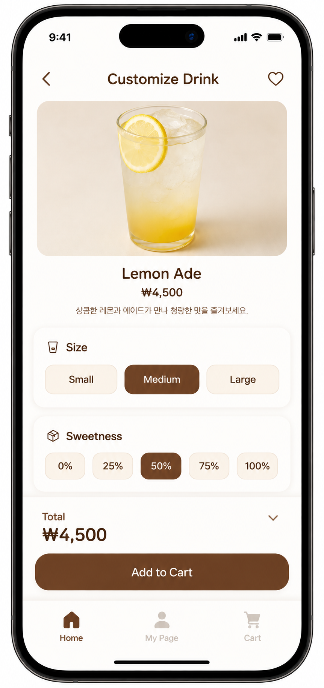

**초안 문제점 분석**
- 부자연스러운 요소: 스마트폰 기기 프레임(테두리, 노치, 버튼)이 함께 생성되어 "프레임 없는 순수 UI 스크린샷" 조건과 불일치
- 레이아웃 문제: 세로형 모바일 화면 비율(9:19.5)이 디바이스 프레임 안에 담긴 형태로 생성되어 실제 화면 비율 파악이 어려움
- 기타: 다른 화면(메인/마이페이지)과 달리 프레임 제거 조건이 초안 프롬프트에 명시되지 않아 발생한 문제

---

#### 3-2. 수정 및 최종 프롬프트

**수정 이미지 프롬프트**
Term Cafe 음료 커스터마이징 화면 이미지 생성 프롬프트(최종본)
모바일 앱 UI 목업, "Term Cafe" 카페 음료 주문 앱의 음료 커스텀 화면.
※ 스마트폰 기기 프레임(테두리, 노치, 버튼 등) 없이, 세로로 긴 화면 비율(9:19.5 비율, 세로형 모바일 스크린)로만 구성된 순수 UI 스크린샷 형태.
(이하 상단/중앙/커스터마이징 옵션/하단 영역/스타일 디테일은 초안과 동일)

**수정 이유**
초안 프롬프트는 "모바일 앱 UI 목업, 'Term Cafe' 카페 음료 주문 앱의 음료 커스터마이징 화면"으로 작성하였다. 하지만 AI가 이를 스마트폰 기기 프레임이 포함된 목업 이미지로 해석하여 생성하였다. 과제에서는 스마트폰 기기 자체가 아닌 앱 화면(UI)만 필요했기 때문에, "스마트폰 기기 프레임(테두리, 노치, 버튼 등) 없이, 세로로 긴 화면 비율(9:19.5 비율, 세로형 모바일 스크린)로만 구성된 순수 UI 스크린샷 형태"라는 조건을 추가하여 프롬프트를 수정하였다.

**최종 선택 이유**
프롬프트에 스마트폰 기기 프레임을 제외하는 조건과 세로형 모바일 화면 비율을 명시한 결과, 스마트폰 목업이 아닌 앱 화면만 표시되는 UI 스크린샷이 생성되었다. 또한 음료 이미지, 커스터마이징 옵션, 가격, 버튼, 하단 내비게이션 등 필요한 UI 요소가 자연스럽게 배치되어 실제 모바일 앱 화면과 유사한 결과를 얻을 수 있었기 때문에, 별도의 추가 수정 없이 이 결과물을 수정본이자 최종본으로 채택하였다.

**수정 및 최종 결과 이미지**
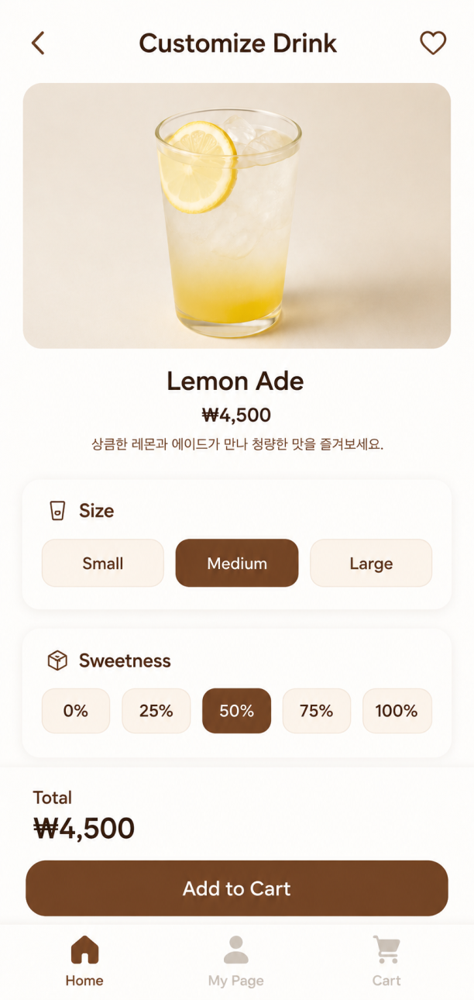

**수정 후 달라진 점**
- 변경 전: "모바일 앱 UI 목업"이라는 표현만 사용하여 스마트폰 기기 프레임이 포함된 목업 형태의 이미지가 생성되었다.
- 변경 후: 스마트폰 프레임을 제외하고 세로형 모바일 화면 비율의 순수 UI 스크린샷 형태가 생성되어 과제에서 요구하는 결과에 더 적합해졌으며, 추가 수정 없이 최종본으로 채택되었다.

---

### 🖥️ Screen 4 : 결제 페이지

#### 3-1. 초안 프롬프트

**초안 이미지 프롬프트**
모바일 앱 UI 목업, "Term Cafe" 카페 음료 주문 앱의 "결제 내역(주문 확인)" 화면.
※ 스마트폰 기기 프레임 없이, 세로형 모바일 화면 비율(9:19.5)로 구성된 순수 UI 스크린샷.
※ 이 화면은 오직 결제 내역/주문 확인 화면만 표현하며, 홈 화면 요소(카테고리 탭, 하단 네비게이션 전체 메뉴 등)는 포함하지 않음.

[전체 무드]
따뜻하면서도 차분한 감성 디자인, 미니멀 UI, 둥근 카드, 화이트 & 브라운·베이지 톤.

[상단 헤더]
좌측에 뒤로가기 화살표 아이콘, 중앙 또는 좌측에 "주문내역" 타이틀 텍스트(브라운 컬러, 굵은 산세리프).

[매장/수령 방법 영역]
둥근 카드 형태로 매장명 표시(예: "Term Cafe 엑스포점"), 그 아래에 "매장"/"포장" 체크 가능한 토글 버튼 두 개 배치.
선택된 항목은 브라운 배경 + 화이트 텍스트 + 체크 아이콘, 미선택 항목은 베이지 아웃라인.

[메뉴 내역 - 단일 상품]
좌측: LemonAde 음료 썸네일 / 중앙: 메뉴명 "LemonAde", 수량 "x1" / 우측: 가격 "₩4,500"
카드는 화이트 배경에 부드러운 그림자, 둥근 모서리.

[가격 상세 영역]
상품금액 ₩4,500 / 총 결제금액 ₩4,500(굵은 폰트로 강조)

[결제 수단 선택]
체크 가능한 라디오 버튼 리스트: 신용카드 / 카카오페이 / 네이버페이 / Term Cafe 포인트 결제

[하단 고정 결제 버튼]
화면 최하단에 풀와이드 둥근 버튼, "₩4,500 결제하기" 형태로 최종 금액과 결제 액션 동시 표시.

[스타일 디테일]
전체적으로 라운드 처리, 여백과 타이포그래피 중심의 미니멀 UI, 모든 금액은 한국 원화(₩) 표기.

**초안 결과 이미지**
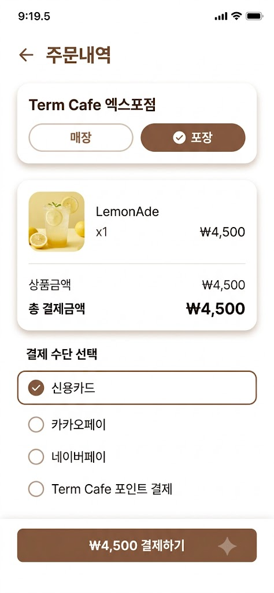

**초안 문제점 분석**
- 부자연스러운 요소: 스마트폰 시스템 상태표시줄(시간, 와이파이, 배터리)이 함께 생성되어 "디바이스 프레임 없는 순수 UI 스크린샷" 조건과 불일치
- 레이아웃 문제: 세로형 스마트폰 화면 비율(9:19.5)의 디바이스 프레임 형태로 생성되어 흰색 배경 단독 구성 의도와 맞지 않았음
- 기타: 상단 헤더 타이틀 텍스트가 "주문내역"으로 표기되어 실제 화면 성격(장바구니)과 명칭이 불일치

#### 3-2. 수정 프롬프트

**수정 이미지 프롬프트**
장바구니 화면. 상단바에서 시간이나 와이파이 같은 부분만 삭제해서 다시 제작해줘.
절대 다른 부분을 건들지 말도록 해.

**수정 이유**
초안은 "스마트폰 기기 프레임 없이 순수 UI 스크린샷으로 구성"이라는 조건을 명시했음에도 결과물에는 시간·와이파이·배터리 등 시스템 상태표시줄과 스마트폰 화면 비율의 디바이스 프레임이 함께 생성되어 조건과 어긋났음. 이에 따라 상태표시줄 요소 제거(단, 앱 헤더까지 함께 삭제되지 않도록 "시간·와이파이만" 대상으로 지시 범위를 구체화), 상단 타이틀 텍스트를 실제 화면 성격에 맞는 "장바구니"로 수정하는 방향으로 프롬프트를 순차적으로 다듬음.

**수정 결과 이미지**
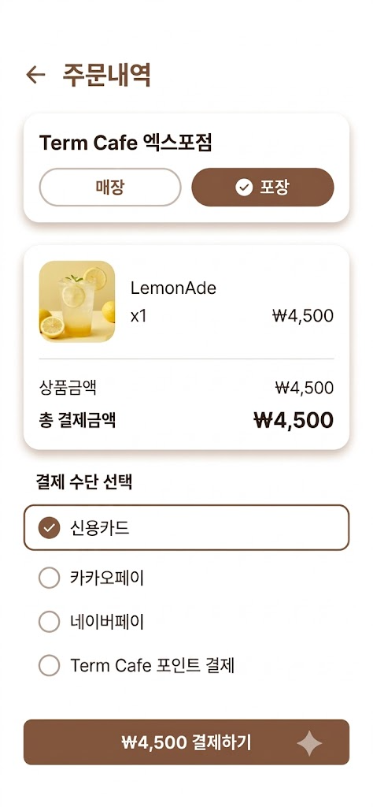

**수정 후 달라진 점**
- 변경 전: 세로형 스마트폰 화면 비율의 디바이스 프레임, 시간·와이파이·배터리 등 시스템 상태표시줄 포함, 상단 타이틀 "주문내역"
- 변경 후: 디바이스 프레임 없이 순수 흰색 배경, 시스템 상태표시줄 제거, 상단 타이틀 "장바구니"로 변경, 나머지 카드 디자인·결제수단 선택·하단 결제 버튼 등 핵심 UI 구조는 유지

#### 3-3. 최종 프롬프트

**최종 선택 이유**
목적에 맞지 않는 불필요한 요소(시스템 상태표시줄, 디바이스 프레임)를 모두 제거하면서도 카드 레이아웃·컬러 톤·결제 버튼 등 핵심 UI 완성도는 그대로 유지되었고, 화면 성격에 맞는 정확한 타이틀("장바구니")까지 반영되어 실제 사용 목적에 가장 부합하는 결과물이었기 때문에 최종본으로 선택함.

**최종 결과 이미지**
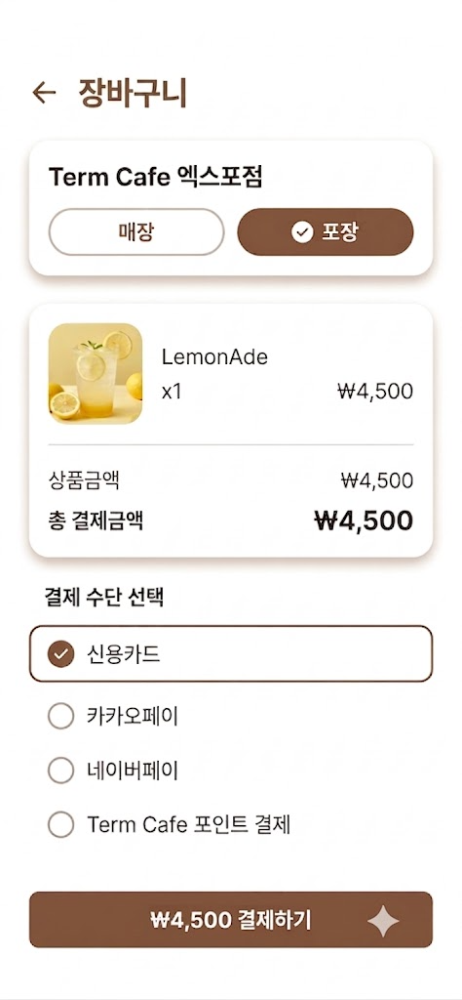

---

### 🖥️ Screen 5 : 결제 완료 페이지

#### 3-1. 초안 프롬프트

**초안 이미지 프롬프트**
모바일 앱 UI 목업, "Term Cafe" 카페 음료 주문 앱의 "결제 완료" 화면.
※ 스마트폰 기기 프레임 없이, 세로형 모바일 화면 비율(9:19.5)로 구성된 순수 UI 스크린샷.
※ 이 화면은 오직 결제 완료(주문 확정) 화면만 표현하며, 이전 결제 내역 화면 요소(메뉴 리스트, 결제 수단 선택 등)는 포함하지 않음.
상단바에는 아무것도 존재하지 않도록 제작해줘.

[전체 무드]
따뜻하면서도 차분한 감성 디자인, 미니멀 UI, 둥근 요소, 화이트 & 브라운·베이지 톤. 완료 화면이므로 안정감과 신뢰감을 주는 여백 중심 레이아웃.

[상단 중앙 - 성공 표시]
원형 배지 안에 체크마크(✓) 아이콘, 그 아래 "주문이 완료되었습니다" 굵은 텍스트, 보조 텍스트로 "맛있는 음료를 준비하고 있어요" 문구.

[주문 번호]
"주문번호 #0702" 형태로 알약형(pill) 박스에 표시.

[주문 요약 카드]
음료 썸네일(LemonAde) / 메뉴명·수량 / 결제금액 "₩4,500" / 매장·포장 여부 / 매장명("Term Cafe 엑스포점")

[예상 픽업 시간]
시계 아이콘과 함께 "약 5분 후 픽업 가능" 텍스트.

[하단 고정 버튼]
"홈으로 돌아가기" 풀와이드 버튼, 보조 텍스트 링크 "주문 내역 확인하기".

[스타일 디테일]
전체적으로 라운드 처리, 여백과 타이포그래피 중심의 미니멀 UI, 모든 금액은 한국 원화(₩) 표기.

**초안 결과 이미지**
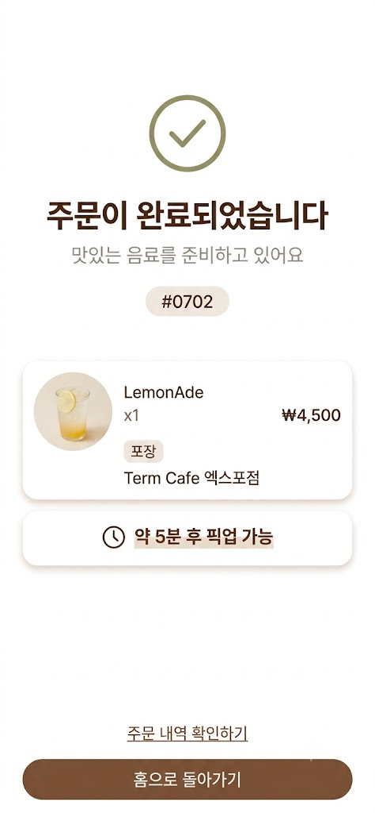

#### 3-2. 최종 프롬프트

**최종 선택 이유**
초안 결과 이미지에 문제가 없어 최종으로 결정.

**최종 결과 이미지**


---

## 4. 이미지 일관성 유지 전략

> 화면 간 스타일 통일을 위해 사용한 방법을 기록합니다.

| 방법 | 적용 여부 | 상세 내용 |
|------|-----------|-----------|
| 시드(Seed) 고정 | N | 시드 고정 없이, 아래 공통 컬러 코드와 프롬프트 키워드로 스타일 일관성 확보 |
| 이미지 레퍼런스 활용 | Y | 이전 화면(메인) 결과 이미지를 다음 화면 생성 시 함께 참조시켜 브라운·베이지 톤과 카드 스타일을 유지함 |
| 공통 프롬프트 키워드 | Y | "따뜻하면서도 차분한 감성 디자인", "미니멀하고 깔끔한 UI", "브라운·베이지·크림 톤", "둥근 모서리(rounded corner)", "9:19.5 세로형, 프레임 없는 순수 UI 스크린샷" |
| 색상 팔레트 고정 | Y | Primary Brown `#7A4528` / Dark Brown `#482313` / Medium Brown `#956044` / Cream `#F7F0E6` / Light Beige `#EFE4D4` / Background `#FFFDFC` / Border Beige `#D9C7B5` / Disabled Gray Beige `#C9C0B7` / Success Olive `#949368` / Main Text `#2F170D` / Secondary Text `#8E8178` (Figma Make 작업 시 적용한 컬러 시스템) |
| 기타 방법 | | 매 화면 프롬프트 앞부분에 "홈 화면과 동일한 디자인 시스템과 컬러 팔레트를 유지한다"는 문구를 반복 삽입하여 스타일 이탈 방지 |

---

## 5. 이미지 후가공 기록

> AI 생성 이미지에서 발견한 문제와 수정 방법을 기록합니다.

| 화면 | 문제 유형 | 수정 방법 | 사용 도구 | 수정 전/후 비교 |
|------|-----------|-----------|-----------|-----------------|
| Screen 1 (메인) | 가격 원화 기호(₩) 깨짐, 스마트폰 프레임 포함 | 프롬프트 재수정(프레임 제거 조건 명시, 원화 기호 명시) | 프롬프트 수정을 통한 재생성 (나노바나나) | 전: `01_main_draft.png` / 후: `03_main_final.png` |
| Screen 2 (마이페이지) | 주문 날짜 중복, 브랜드 로고 부재 | 프롬프트 재수정(날짜 로직·항목 삭제 지시, 로고 추가 지시) | 프롬프트 수정을 통한 재생성 (나노바나나) | 전: `04_mypage_draft.png` / 후: `06_mypage_final.png` |
| Screen 3 (음료 커스텀) | 스마트폰 프레임 포함 | 프롬프트 재수정(프레임 제거 조건 명시) | 프롬프트 수정을 통한 재생성 (나노바나나) | 전: `11_drink_custom_v1.png` / 후: `12_drink_custom_v2.png` |
| Screen 4 (결제) | 시스템 상태표시줄 포함, 화면 타이틀 명칭 오류 | 프롬프트 재수정(상태표시줄 제거, 타이틀 "장바구니"로 수정) | 프롬프트 수정을 통한 재생성 (나노바나나) | 전: `07_payment_v1.png` / 후: `09_payment_final.png` |
| Screen 5 (결제 완료) | 없음 | - | - | 초안이 곧 최종본 |

**후가공 시 사용한 기능 체크리스트**
- [ ] 인페인팅 (Inpainting)
- [ ] 아웃페인팅 (Outpainting)
- [ ] 업스케일링 (Upscaling)
- [x] 텍스트/요소 직접 재지시 (프롬프트 반복 수정을 통한 재생성 — 별도 이미지 편집 툴 미사용)
- [ ] 기타:

---

## 6. Figma 프로토타입

| 항목 | 내용 |
|------|------|
| Figma 링크 | [Term Cafe UI Gen](https://www.figma.com/make/h0xksj0mKmBGnCpy6WO9fn/Term-Cafe-UI-Gen?t=CIHu5ePxqupGKMzu-1) |
| 화면 전환 흐름 | 메인 → 음료 커스텀 → 결제(장바구니) → 결제 완료 / 메인 ↔ 마이페이지 (하단 네비게이션 통해 이동) |
| Hotspot 적용 영역 | 하단 네비게이션 바(홈/마이페이지/장바구니), 메인 화면 메뉴 카드 → 음료 커스텀 화면, "Add to Cart" 버튼 → 결제 화면, "결제하기" 버튼 → 결제 완료 화면 |

**화면 흐름 다이어그램**

```
메인 페이지 ──(메뉴 카드 클릭)──▶ 음료 커스텀 페이지 ──(Add to Cart)──▶ 결제 페이지 ──(결제하기)──▶ 결제 완료 페이지
     │▲                                                                                              │
     └┴────────────────(하단 네비게이션: 홈 ↔ 마이페이지)────────────────  마이 페이지               │
     ◀─────────────────────────────(홈으로 돌아가기)───────────────────────────────────────────────┘
```

---

## 7. 최종 산출물 체크리스트

### 필수 요구사항

**이미지 생성**
- [x] 이미지 생성 AI 도구 1개 이상 사용 (제미나이 나노바나나)
- [x] 최소 3개 화면 생성 (메인 / 마이페이지 / 음료 커스텀 / 결제 / 결제 완료 — 총 5개)
- [x] 화면 비율 준수 (모바일 9:16 계열, 9:19.5)
- [x] 파일 형식 PNG

**프롬프트 최적화**
- [x] 초안 → 수정 → 최종 과정 문서화
- [x] 각 수정 단계의 변경 이유 기록
- [x] 결과 차이 기록

**이미지 후가공**
- [x] 텍스트 깨짐 수정 완료 (Screen 1 원화 기호 등)
- [x] 부자연스러운 요소 수정 완료 (프레임/상태표시줄 제거 등)

**프로토타입**
- [x] Figma에 이미지 배치 완료
- [x] Hotspot 또는 화면 전환 흐름 표시 완료
- [x] Figma 링크 공유 설정 완료 (링크는 6번 항목 참고)

### 보너스 (선택)
- [x] 디자인 시안 → HTML/CSS 코드 변환 완료
  - 사용 도구: Claude (Opus 5)
  - 변환 결과물 위치: GitHub 저장소에 별도 업로드 예정 (`Bonus_code.html`)

---

## 8. 회고 및 학습 내용

**Q1. 프롬프트 구성 요소(스타일, 레이아웃, 색상 등)가 결과물에 미치는 영향은?**
> 프롬프트는 크게 스타일, 레이아웃, 색상 세 가지 요소로 구성되며, 각각 결과물의 분위기, 구조, 시각적 톤을 결정한다. 스타일 키워드(예: minimalist, flat design)는 UI의 전체적인 디자인 언어를 결정하고, 레이아웃 키워드(예: card-based layout, bottom navigation bar)는 정보 배치 방식을 결정하며, 색상 키워드(예: warm beige and brown color palette)는 브랜드 분위기를 결정한다. 프롬프트를 구체적으로 명시할수록 의도한 디자인에 가까운 결과물을 얻을 수 있었으며, 모호한 키워드는 예측하기 어려운 결과를 초래했다.

**Q2. AI 생성 이미지의 문제점을 식별하고 수정하는 방법은?**
> 이번 작업에서 반복적으로 발생한 문제는 크게 두 가지였다. 첫째는 텍스트/기호 깨짐(원화 기호 ₩가 W로 표기되는 등)이었고, 둘째는 "스마트폰 프레임 없는 순수 UI"라는 조건이 프롬프트 앞부분에만 있으면 AI가 이를 놓치고 디바이스 프레임·상태표시줄을 함께 생성하는 문제였다. 이를 해결하기 위해 (1) 문제가 발생한 요소를 구체적으로 짚어 재프롬프트에 반영하고, (2) "다른 부분은 절대 수정하지 마"처럼 변경 범위를 명확히 제한하는 지시를 추가해 의도치 않은 재생성을 방지했다. 결과적으로 원인을 정확히 짚어 좁은 범위로 재지시하는 방식이, 프롬프트 전체를 새로 쓰는 것보다 원하는 결과에 더 빠르게 도달하는 방법이었다.

**Q3. AI 생성 이미지의 일관성을 유지하기 위해 사용한 방법은?**
> 시드 값을 고정하는 방식 대신, 모든 화면 프롬프트에 공통 키워드(따뜻한 브라운·베이지·크림 톤, 미니멀한 여백 중심 레이아웃, 9:19.5 프레임 없는 순수 UI 스크린샷)를 반복 포함시키고, "홈 화면과 동일한 디자인 시스템과 컬러 팔레트를 유지한다"는 문구를 매 프롬프트에 명시하는 방식으로 일관성을 확보했다. 이미지 문제 수정 역시 별도 편집 툴 없이 프롬프트 재지시만으로 진행해, 스타일 일관성이 프롬프트 레벨에서 유지되도록 했다.

**Q4. 기획 → 이미지 생성 → 후가공 → 프로토타입 워크플로우를 설명하면?**
> 먼저 서비스 컨셉(카페 주문 앱)과 5개 화면의 역할을 기획 단계에서 정의한 뒤, 화면별로 초안 프롬프트를 작성해 이미지를 생성했다. 생성된 이미지를 검토해 텍스트 깨짐·프레임 포함·정보 불일치 등의 문제를 항목별로 분석하고, 문제 원인에 맞춰 프롬프트를 좁은 범위로 재수정하는 과정을 1~2회 반복해 최종 이미지를 확정했다. 이후 확정된 5개 화면 이미지를 Figma로 옮겨 화면 간 이동 흐름(하단 네비게이션, 버튼 클릭 등)에 Hotspot을 연결해 클릭 가능한 프로토타입으로 완성했다. 이 워크플로우를 통해 이미지 생성은 "한 번에 완성"이 아니라 "생성 → 진단 → 재지시"를 반복하는 반복적 협업 과정임을 확인할 수 있었다.

---

## 9. 참고 자료

| 구분 | 링크 / 출처 |
|------|-------------|
| 사용 AI 도구 | 제미나이 나노바나나(이미지 생성), ChatGPT(프롬프트 작성 보조), Figma Make(프로토타입) |
| 레퍼런스 이미지 | **[확인 필요]** |
| 후가공 도구 | 별도 편집 툴 없이 프롬프트 재수정 방식으로 진행 |
| 기타 | 보너스 과제(디자인 시안 → HTML/CSS 변환): Claude (Opus 5) |

## 10. 보너스 과제
완료. 파일명: `Term Cafe.html` (GitHub 저장소에 별도 업로드)
